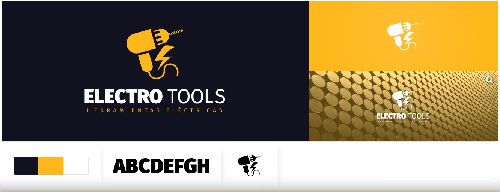
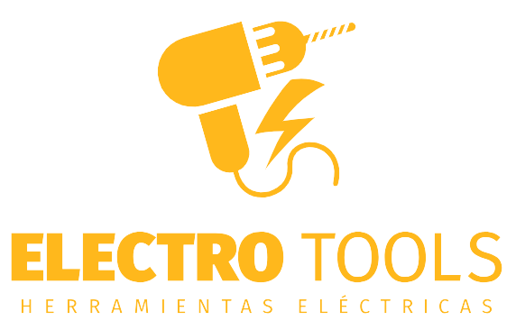
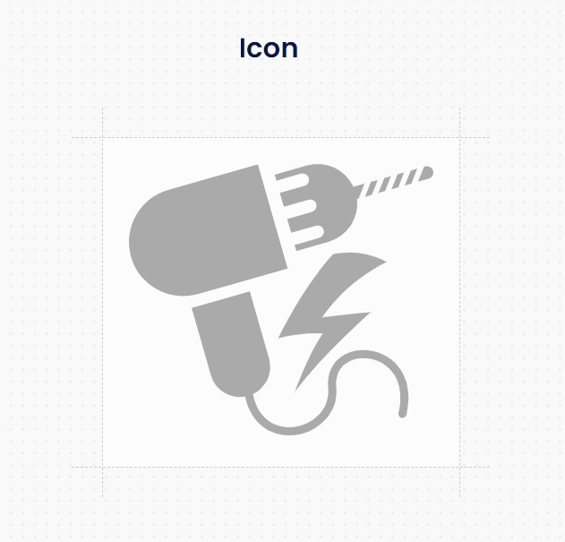
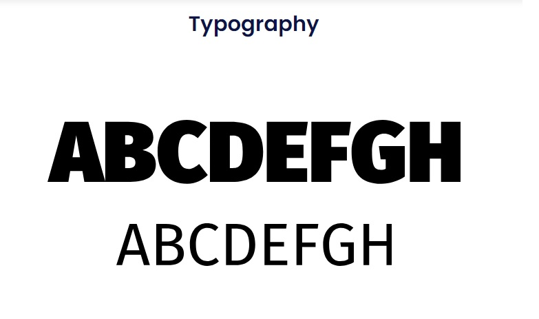
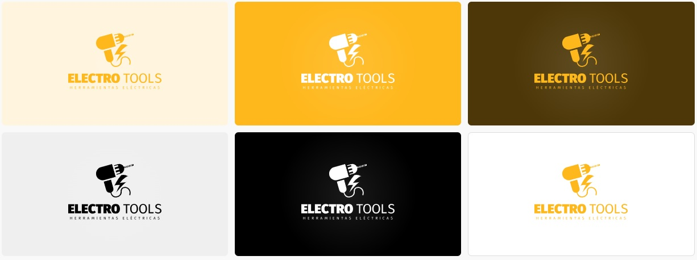
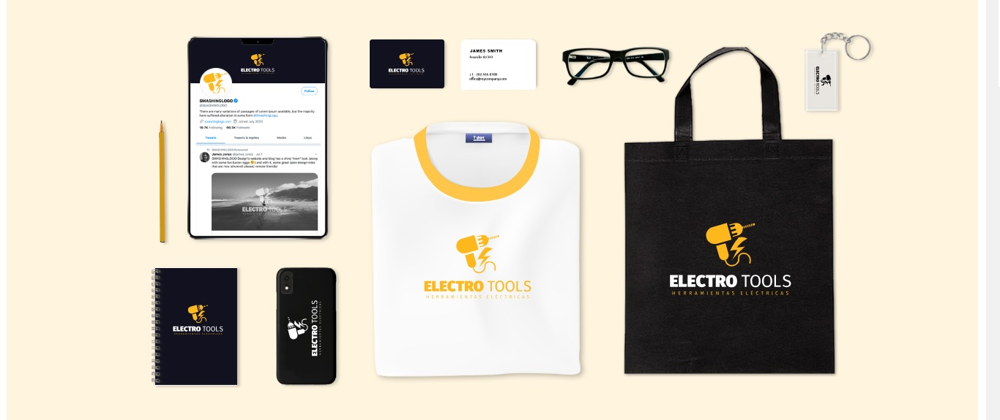
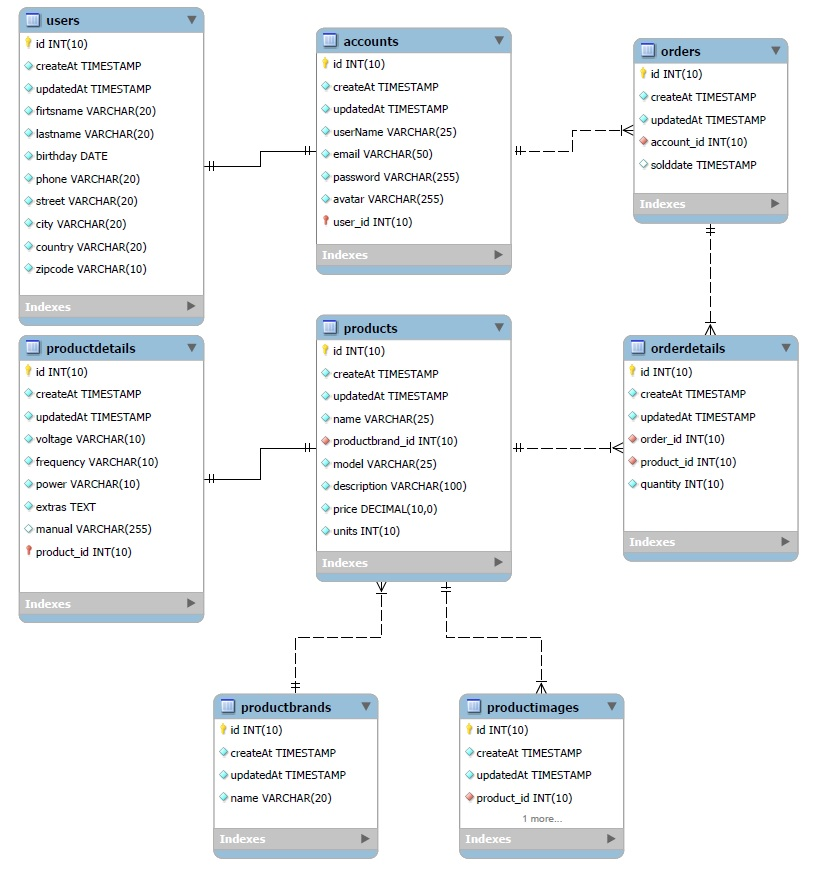

# Proyecto ElectroTools - Herramientas Eléctricas

## Integrantes

- Cristian Godoy: Cristian Godoy: integrante del "Team Dinamita" 🧨  el mejor team de los ultimos 50 años. Mi proposito es hacerles explotar la cabeza con el mejor proyecto que verán en sus vidas 🤯  Es broma, mi propósito es hacer todo lo que dice Dante 😌.
Creo firmemente que el mejor helado es el de dulce de leche. Y no voy a tolerar que me digan lo contrario.
Soy el responsable de los wireframe de "login" y "caja de herramientas".
Me representa el minimalismo, la simpleza y funcionalidad.
- Florencia Tula: ¡Hola a todos! Soy Flor, la novata y una de las integrantes junior del "Team Dinamita". Mi aportación al equipo incluyó los wireframes de las secciones "Novedades" y "Formulario de Registro". ¡Un saludo a todos! 👋🏻.
- Gustavo Daniel Moya: Buenas tardes, mi nombre es Gustavo, aunque todos me llaman Gus. Soy de Santa María, Catamarca. Me encargué de diseñar los wireframes para el Encabezado de la página y la Barra de Navegación, así como para la sección "About Us" 🙍‍♂️🙍‍♂️🙍‍♂️.
- Raúl Manuel Calvimonte: ¡Hola a todos! Soy Raúl, el más joven del grupo y el creador del nombre del Equipo Dinamita 🧨. Además, colaboré en la creación de los wireframes para las secciones "Destacados" y "Detalles del Producto". Tengo 18 años y me encantan los videojuegos 👾.
- Dante Delprato: Buenas a todos y mucho gusto, mi nombre es Dante y soy un Córdobes extraviado en Catamarca 🤓. He intentado brindarle al equipo todo el apoyo necesario para llevar esto adelante. Me he encargado de realizar la infraestructura del proyecto: Canal de Discrod del equipo, Trello, GitHub. También desarrollé el logo y el concepto del proyecto.
En cuanto a los wireframe hice el "pie de página", y unirlos todos en un solo "home". 

## Concepto del Proyecto

Nosotros hemos elegido como proyecto desarrollar una pág. de venta de Herramientas Eléctricas.
La idea es verse lo más profesional y confiable posible, pero sin perder la sensación de amistad y próximidad con el cliente. 

Nuestro público objetivo son ferreterias, pequeñas/medianas empresas, particulares y profesionistas. Vislumbramos una franja etaria de 25 a 60 años, principalmente masculinos, tanto para compras al por mayor y al por menor.

## Pág. Wev de Referencia:

- Nuestras páginas de inspiración fueron:
- https://ar.dewalt.global/
- https://www.brementools.com/
- https://www.ar.boschherramientasinalambricas.com/
- https://www.bulfer.com.ar/
- https://ar.stanleytools.global/

y no descartamos la posibilidad de copiar estructuras pensadas específicamente para esta industria, como las sugeridas en:
- https://nicepage.com/st/14131/factory-works-industrial-website-template
solo por dar un ejemplo.

## Wireframes

- [Home](./public/wireframes/Home---Desktop.pdf)
- [Login](./public/wireframes/Login.pdf)
- [Registro](./public/wireframes/Formulario-de-Registro.pdf)
- [About Us](./public/wireframes/AboutUs.pdf)
- [Carrito - Desktop](./public/wireframes/Carrito-Version-Desktop---Wireframe.pdf)
- [Carrito - Mobile](./public/wireframes/Carrito-Version-Mobile---Wireframe.pdf)
- [Detalle del Producto](./public/wireframes/Detalles-del-Producto---Desktop.pdf)
- [Detalle del Producto - Mobile](./public/wireframes/Detalles-del-Producto---Mobile.pdf)

## Soporte Gráfico

### Identidad

- Color Amarillo #ffb81c
- Color Negro Azulado #11111f
- Color Gris #dcdcdc (fondos)
- Color Rojo de icono #cb483a (iconos)

- Font : Sans serif

### Iconos que se utilizan en la pág.

Extraidos de la pág. FontAwesome
- Flecha hacia atras del header: `<i class="fa-solid fa-arrow-left">`
- Flecha hacia adelante, botones nexts: `<i class="fa-solid fa-arrow-right"></i>`
- Circulo con cruz: `<i class="fa-solid fa-circle-xmark"></i>`
- Etiquetas para indicar descuento: `<i class="fa-solid fa-tags"></i>`

### Merchandising

### Tablero de Trello del equipo:
https://trello.com/b/rryHy42Q/proyecto-integrador

### Base de Datos en SQL
El pdf y los scripts de generacion de la base de datos se encuentan en la ruta "./src/database/seeders/", igualmente se dejan a mano los links a continuación.

<a href="./src/database/seeders/DER.pdf" download>📕 Descargar DER en PDF</a>

<a href="./src/database/seeders/electrotools_db_structure.sql" download>📂 Descargar Script de Estructura</a>

<a href="./src/database/seeders/electrotools_db_data.sql" download>🧾 Descargar Script de Volcado de Datos de la DB</a>

Nota: Se ha comprobado que al colocar la creación completa de cada tabla, campos y Foreigns Keys de una sola vez (como lo entrega MySQL Workbench), ocasiona problemas al ejecutar el script de creación, al cargarlo/importarlo en phpMyAdmin. Estando asi es necesario declarar la creación de las tablas en orden, siguiendo las dependencias y las tablas "padre", como explican los mensajes de error.

Cuando importamos el código de estructura desde MySQL Workbench, los "CREATE TABLE" se ordenan alfabéticamente, lo cual causa conflicto en phpMyAdmin. En su lugar, phpMyAdmin declara todas las tablas de forma independiente y luego, en una sección final, declara las relaciones entre las tablas, evitando estas dependencias.

Por todas estas razones, se dejan expresados los "CREATE TABLE" por un lado, y al final del archivo de estructura de datos se encuentran las relaciones.