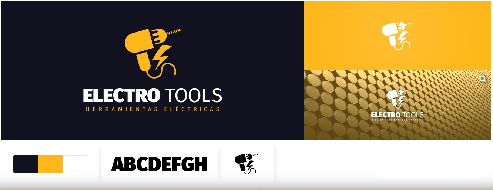
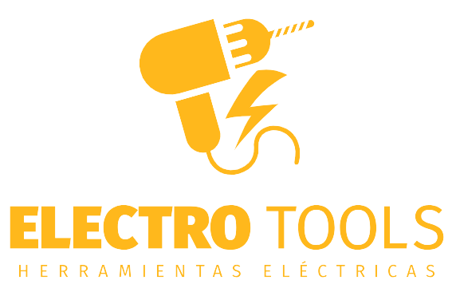
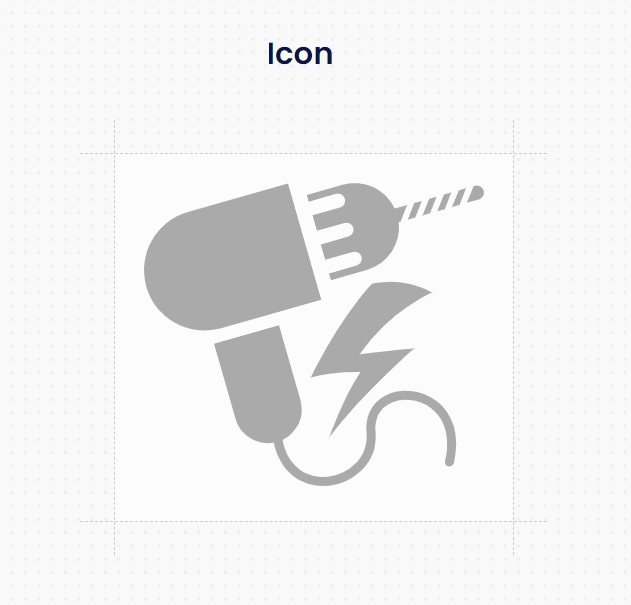
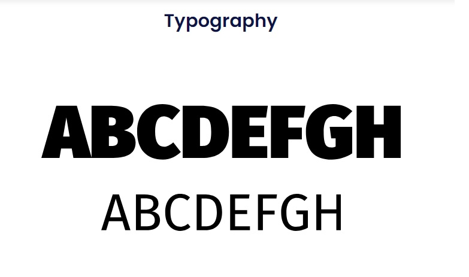
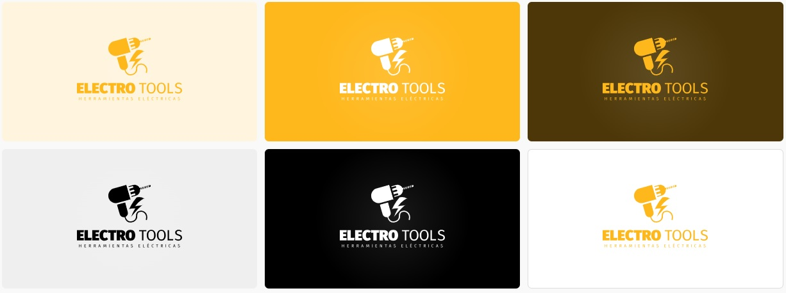
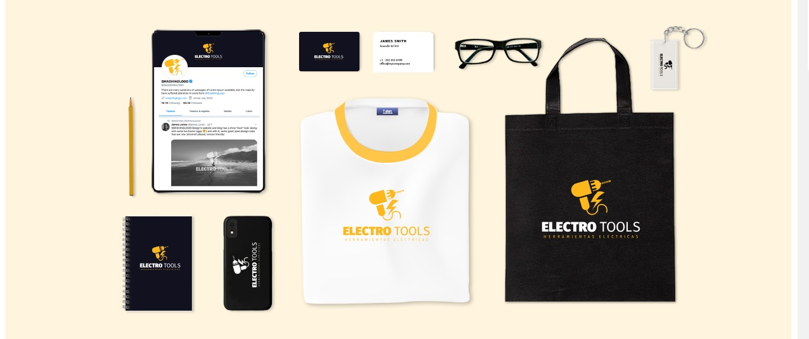

# Proyecto ElectroTools - Herramientas Eléctricas

## Integrantes

- Cristian Godoy: Cristian Godoy: integrante del "Team Dinamita" 🧨  el mejor team de los ultimos 50 años. Mi proposito es hacerles explotar la cabeza con el mejor proyecto que verán en sus vidas 🤯  Es broma, mi propósito es hacer todo lo que dice Dante 😌.
Creo firmemente que el mejor helado es el de dulce de leche. Y no voy a tolerar que me digan lo contrario.
Soy el responsable de los wireframe de "login" y "caja de herramientas".
Me representa el minimalismo, la simpleza y funcionalidad.
- Florencia Tula: ¡Hola a todos! Soy Flor, la novata y una de las integrantes junior del "Team Dinamita". Mi aportación al equipo incluyó los wireframes de las secciones "Novedades" y "Formulario de Registro". ¡Un saludo a todos! 👋🏻.
- Gustavo Daniel Moya: Buenas tardes, mi nombre es Gustavo, aunque todos me llaman Gus. Soy de Santa María, Catamarca. Me encargué de diseñar los wireframes para el Encabezado de la página y la Barra de Navegación, así como para la sección "About Us" 🙍‍♂️🙍‍♂️🙍‍♂️.
- Raúl Manuel Calvimonte: ¡Hola a todos! Soy Raúl, el más joven del grupo y el creador del nombre del Equipo Dinamita 🧨. Además, colaboré en la creación de los wireframes para las secciones "Destacados" y "Detalles del Producto". Tengo 18 años y me encantan los videojuegos 👾.
- Dante Delprato: Buenas a todos y mucho gusto, mi nombre es Dante y soy un Córdobes extraviado en Catamarca 🤓. He intentado brindarle al equipo todo el apoyo necesario para llevar esto adelante. Me he encargado de realizar la infraestructura del proyecto: Canal de Discrod del equipo, Trello, GitHub. También desarrollé el logo y el concepto del proyecto.
En cuanto a los wireframe hice el "pie de página", y unirlos todos en un solo "home". 

## Concepto del Proyecto

Nosotros hemos elegido como proyecto desarrollar una pág. de venta de Herramientas Eléctricas.
La idea es verse lo más profesional y confiable posible, pero sin perder la sensación de amistad y proximidad con el cliente. 

Nuestro público objetivo son ferreterias y pequeñas/medianas empresas, como asi tambien particulaes y profesionista. Vislumbramos una franja etaria de 25 a 60 años, principalmente masculinos, tanto para compras al por mayor y menor.

## Pág. Wev de Referencia:

Nuestas paginas de inspiracion fueron:
https://ar.dewalt.global/
https://www.brementools.com/
https://www.ar.boschherramientasinalambricas.com/
https://www.bulfer.com.ar/
https://ar.stanleytools.global/

y no descartamos el recurso de copiar estructuras pensadas especificamente para esta insdustria, como las sujeridas en:
https://nicepage.com/st/14131/factory-works-industrial-website-template
solo por dar un ejemplo.

## Wireframes

- [Home](./public/views/Home---Desktop.pdf)
- [Login](./public/views/Login.pdf)
- [Registro](./public/views/Formulario-de-Registro.pdf)
- [About Us](./public/views/AboutUs.pdf)
- [Detalle del Producto](./public/views/Detalles-del-Producto---Desktop.pdf)
- [Detalle del Producto - Mobile](./public/views/Detalles-del-Producto---Mobile.pdf)

## Soporte Gráfico

### Identidad

### Merchandising

